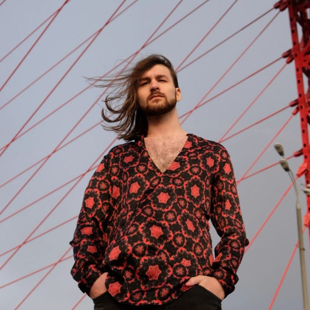

# Резюме

# 

**Маслов Александр Владимирович**

26 лет, родился 4 мая 1996

+7 (905) 7876765
alexm-96@yandex.ru    

**Проживает**:

Москва, Зеленоград

**Гражданство**: Россия

**Образование**:

Высшее

Московский государственный областной университет, Москва
Лингвистический факультет, Перевод и переводоведение

**Знание языков**:

- Русский — Родной
- Английский — C2
- Немецкий — B1
- Японский — A2

**Навыки**:

- Обучаемость
- Умение работать с людьми  
- Грамотная речь
- Умение работать в команде  
- Ведение переговоров 
- Деловое общение
- Работа с большим объемом информации  
- Деловая переписка  
- Телефонные переговоры  
- Грамотность  
- Уверенный пользователь ПК  
- Английский язык  
- Поиск информации в интернет  
- Деловая коммуникация

**Личные качества**: 

Аккуратность, коммуникабельность, активная жизненная позиция и позитивный настрой, cпособность выстраивать рабочий процесс, последовательность и системность в
работе, высокое чувство ответственности, отсутствие вредных привычек, стрессоустойчивость

**Хобби**: музыка, путешествия, фитнес, изучение японского языка и культуры.

